# 台风实时预测（定稿候选 · 待作者终审）

> 依据 `docs/台风实时预测_教程大纲_v0.1.md` 反推撰写，定稿日期 2026-07-18。
> 配图目录：`docs/images/台风实时预测/`，共 17 张；对话类配图为**示意重演图**（内容取自真实制作记录，图内已标注），页面/仓库类配图为线上实拍或历史版本复现，图内均有角标说明。
> 开场录屏：`素材/台风实时预测_30s演示.mp4`（约 30 秒，本机素材目录，不入 git）。

---

## 0. 先看成品

▶ 30 秒线上演示录屏：实况面板 → 蓝黄橙红四级预警切换 → 预案清单勾选 → 昼夜主题切换。（`素材/台风实时预测_30s演示.mp4`）

这是一个挂在 B站上的真网站：台风数据**每 15 分钟自动更新**，上线后还拿到了 B站官方推流。而它的起点，只是对 Codex 说的一句话——

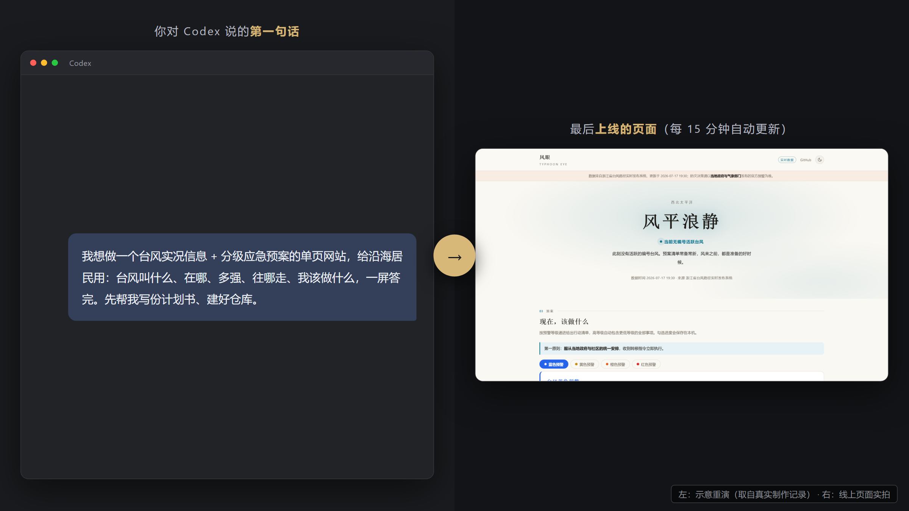

这一章的玩法一句话讲完：**立项 → 搭页面 → 接真实数据 → 发上 B站，全程都是「跟 Codex 对话」。**

## 1. 先认识你的建站班底

这次建站不是 Codex 一个人干活，它背后是一支各管一摊的班底：

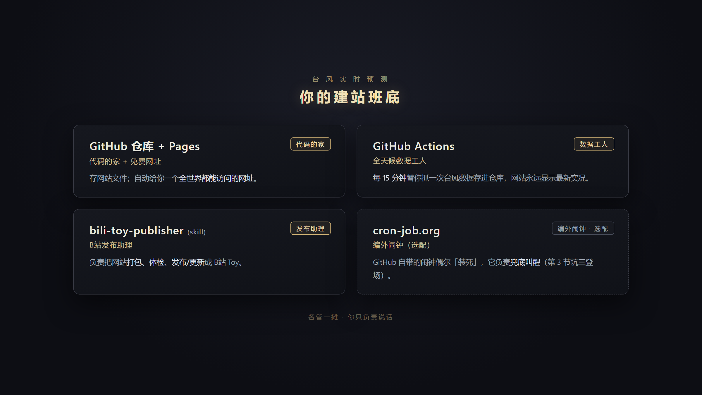

- **GitHub 仓库 + Pages —— 代码的家 + 免费网址。** 存网站文件；自动给你一个全世界都能访问的网址。
- **GitHub Actions —— 全天候数据工人。** 每 15 分钟替你抓一次台风数据存进仓库，网站永远显示最新实况。
- **bili-toy-publisher（skill）—— B站发布助理。** 负责把网站打包、体检、发布/更新成 B站 Toy。
- **cron-job.org —— 编外闹钟（选配）。** GitHub 自带的闹钟偶尔「装死」，它负责兜底叫醒（第 3 节坑三登场）。

skill 的安装你在实战 2 已经会了：把素材包发给 Codex，说一句「帮我安装 bili-toy-publisher」即可。

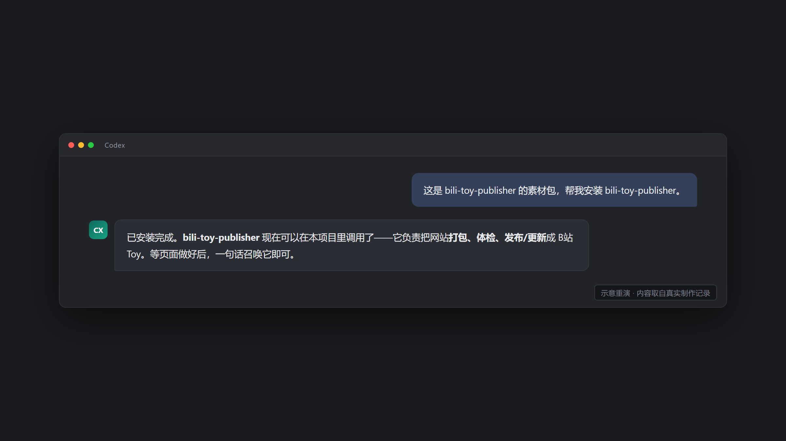

账号注册等准备工作，见文末的准备清单卡片。

## 2. 建站实操：从一句话到台风站上线

主线五步，每步都是「你说一段话，Codex 给一个结果」。

### Step 1 · 一句话立项

> 我想做一个台风实况信息 + 分级应急预案的单页网站，给沿海居民用：台风叫什么、在哪、多强、往哪走、我该做什么，一屏答完。先帮我写份计划书、建好仓库。

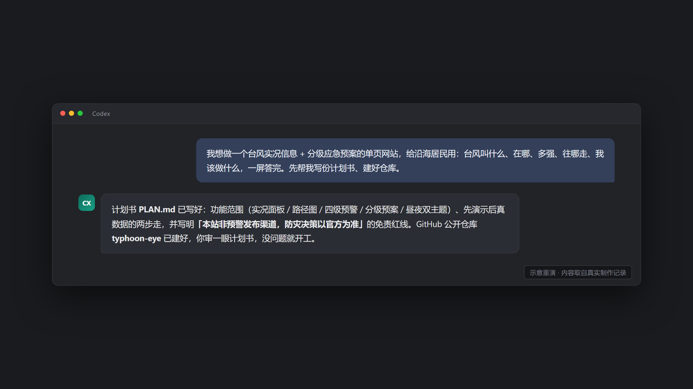

Codex 会回你一份计划书和一个建好的仓库。计划书你只审两处：

1. **功能范围**——列的是不是你想要的东西；
2. **免责红线**——有没有写清「本站不是预警发布渠道，防灾决策以官方为准」。

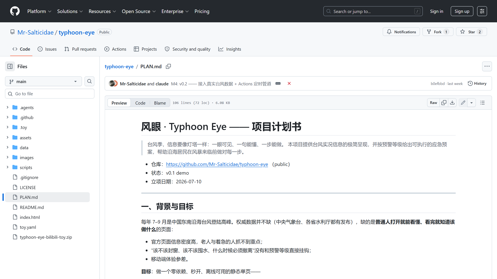

### Step 2 · 搭出第一版页面

> 按计划书把页面搭出来：实况面板、路径示意图、蓝黄橙红四级预警各配一份可勾选的行动清单、昼夜双主题。先用演示数据，页面上标明「演示」。

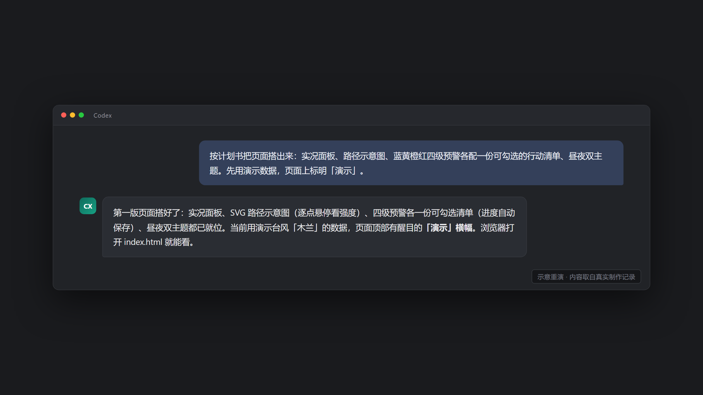

一句话点到：**先用假数据把页面跑通，真数据下一步再接——顺序别反。**

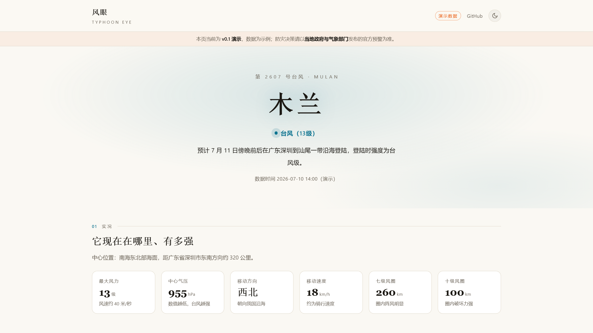

### Step 3 · 让 Codex 自己当质检

> 按计划书里的验收清单自审一遍：控制台报错、手机小屏、深浅主题、勾选后刷新还在不在。发现 bug 直接修，修完给我报告。

本案例实况：Codex 自审揪出 3 个显示 bug——当前位置点颜色不对、悬浮提示位置漂移、地图边缘提示被裁掉——全部自己修掉。你只读报告结论，点头即过。

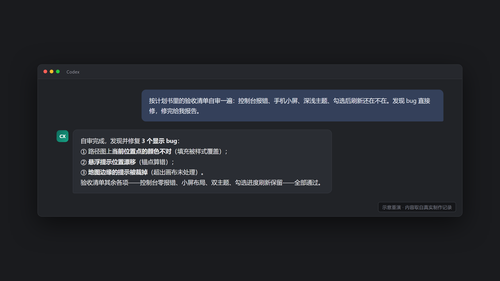

### Step 4 · 接真实数据，网站上线

> 接入浙江省台风路径实时发布系统的真实数据，用 GitHub Actions 每 15 分钟自动抓一次；抓不到时降级显示演示数据并标明。然后发布到 GitHub Pages 上线。

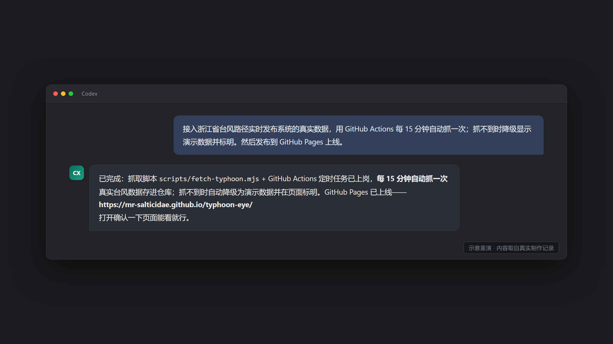

Codex 会产出抓取脚本 + 定时任务。你的活只有一个：**打开线上网址，确认页面能看。**

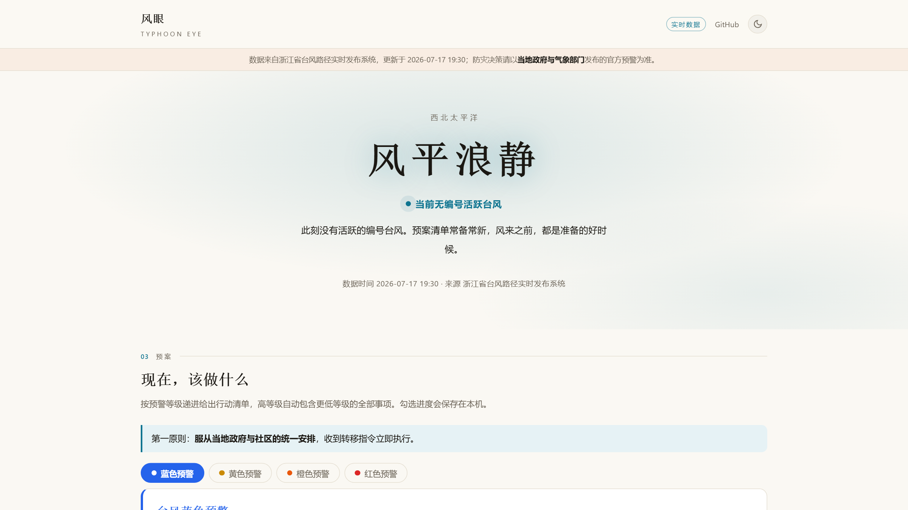

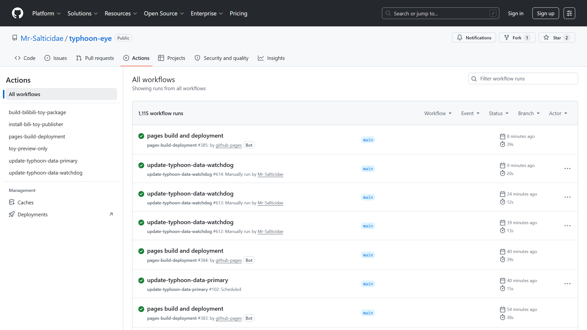

一句避坑贴士：上线后巡检**看页面上的数据时间**，别只看 Actions 的绿色对勾——为什么，第 3 节坑一细说。

### Step 5 · 发布成 B站 Toy

> 用 bili-toy-publisher 把网站打包成 B站 Toy：先做手机端适配、配一张封面，体检通过后给我上传包。

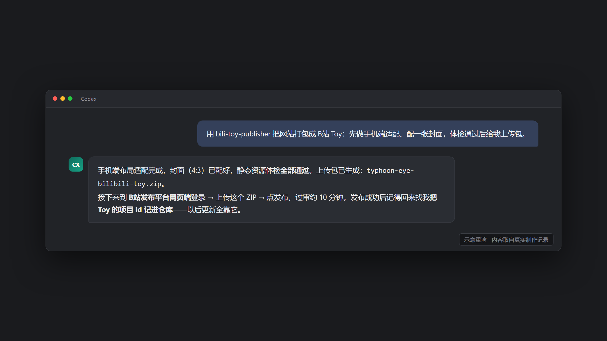

发布动作在 B站发布平台网页端完成：登录 → 上传 ZIP → 点发布，过审约 10 分钟。

发布成功后的第一件事：让 Codex 把 Toy 的**项目 id 记进仓库**——以后更新全靠它，第 3 节坑二就是没记 id 的血泪。

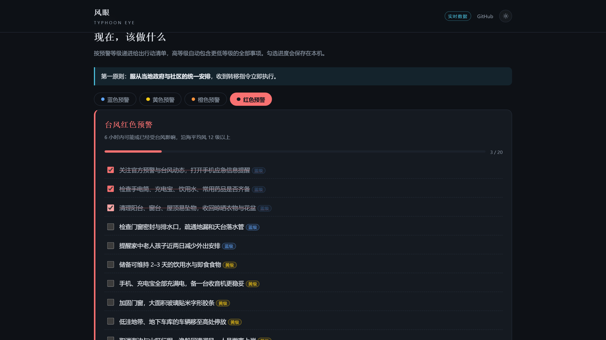

## 3. 上线之后：三个「怎么不更新了」

三个坑全部来自本项目的真实事故。每个坑：一句症状，一句对话解法。

**坑一 · 全绿不等于已发。** 症状：Actions 页面一片绿对勾，线上数据却停更了两天。巡检口诀只有一句：**看页面上的数据时间，别看绿灯。** 对话解法：

> 帮我加一个守护任务：数据过期了才动手补抓，平时空转。

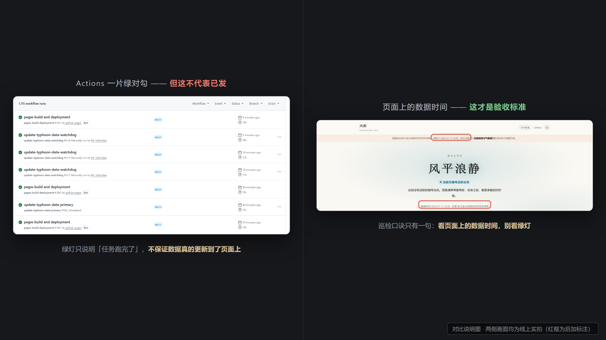

**坑二 · Toy 永远停在第一版。** 症状：仓库里改了好几版，B站上还是首发版。让 Codex 一步定性——「抓一下线上页面，看看版本号是多少」：网址里的 `-v1` 就是铁证，发布之后从没更新成功过。根治动作呼应 Step 5：发布完立刻记项目 id，每次更新后确认**版本号 +1** 才算数。

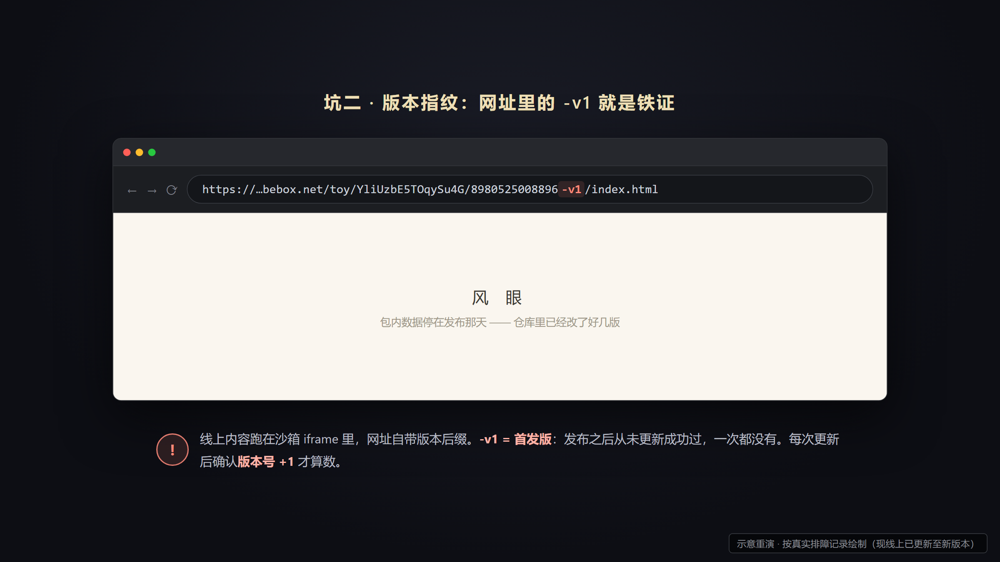

**坑三 · GitHub 的闹钟会丢班（选配）。** 症状：定时任务每小时该跑 4 班，高峰期只被放行 1 班，官方状态页还全绿。对话解法：

> 配一个 cron-job.org 外部闹钟，每 15 分钟戳一下守护任务兜底。

本项目这条兜底**上岗第一次执行，就真实补救了一次丢班**。

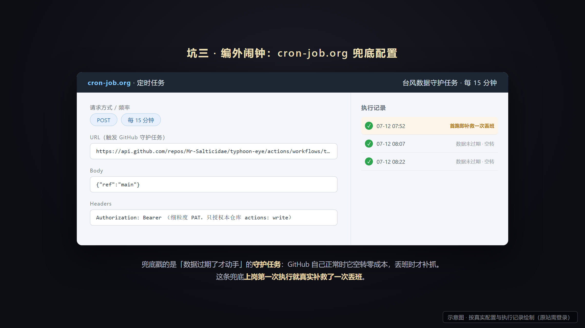

一句彩蛋贴士：页面里的应急电话在 B站 App 里点不动？那是平台沙箱的限制，源码里已带修复，教程不展开。

收尾一句话：网站上线只是开始——数据自己更新、坏了有人兜底。这套「建站 + 保活」流程，你的下一个数据类网站照抄即可。

---

## 结尾卡片 · 开工前的准备清单

| 项目 | 必备/选配 | 说明 |
|---|---|---|
| GitHub 账号 | 必备 | 免费注册；存代码 + 送网址 + 定时工人，全靠它 |
| B站账号 | 必备 | 发布 Toy 用，网页登录即可 |
| bili-toy-publisher skill 素材包 | 必备 | 发给 Codex 说「帮我安装」，同实战2 操作 |
| cron-job.org 账号 | 选配 | 想上第 3 节坑三的外部兜底闹钟才需要，免费 |
