# 桌面小程序开发（定稿候选）

> 依据：`桌面小程序开发_教程大纲_v0.1.md`（2026-07-17 作者指示免中间审核直接展开，本稿待最终统一审核）。
> 配图目录：`docs/images/桌面小程序/`。素材取自源项目 `E:\desk-pond`（已完结 v0.5.0）：成品与新旧版本画面均为本机运行实拍（旧版从 git 历史检出、以 Godot 4.6 重跑截取）；对话类配图为示意重演图（内容取自真实提交记录、图内已标注）。
> 桌面运行录屏：`素材/工位池塘_桌面运行.mp4`（19 秒，本机保存，不入 git）。

---

## 0. 先看成品

▶ 桌面运行录屏：`素材/工位池塘_桌面运行.mp4`（点甩杆开始专注，浮标入水，倒计时走起）

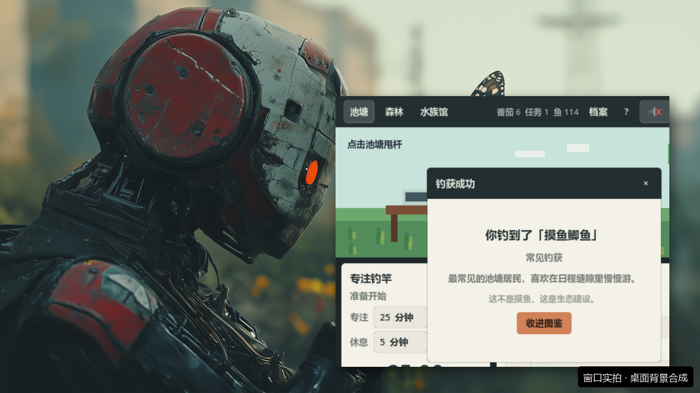

这只「工位池塘」就挂在桌面角落陪你干活：你点「甩杆」开始专注，小人就开始钓鱼；专注结束自动钓上一条鱼；右边写今日任务，勾完一条，小树就长一点。钓来的鱼住进水族馆，种下的树连成森林。

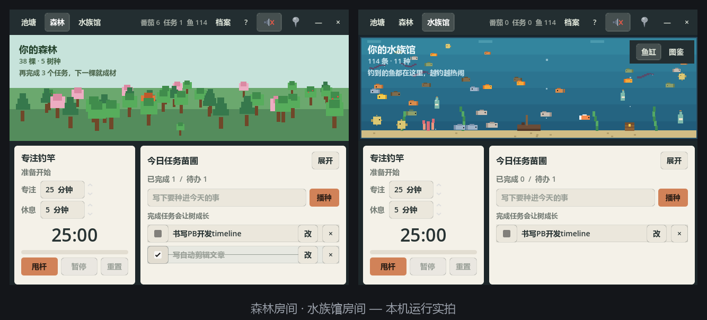

母教程前面的章节里，有一只 Codex 宠物陪你干活；这一章，你亲手造一只完全属于自己的。玩法一句话：**把想法说给 Codex → 一次加一个功能玩着迭代 → 自检打包 → 双击 exe 挂上桌面。** 全程不写一行代码。

## 1. 先认识你的开发班底：Codex + Godot

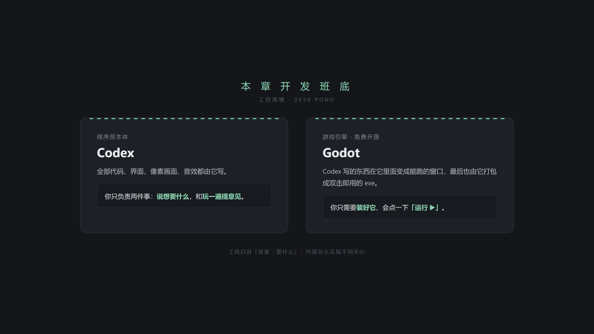

- **Codex** ——程序员本体。全部代码、界面、像素画面、音效都由它写；你只负责说想要什么，和玩一遍提意见。
- **Godot** ——免费开源的游戏引擎。Codex 写的东西在它里面变成能跑的窗口，最后也由它打包成双击即用的 exe；你只需要装好它、会点右上角的「运行 ▶」。

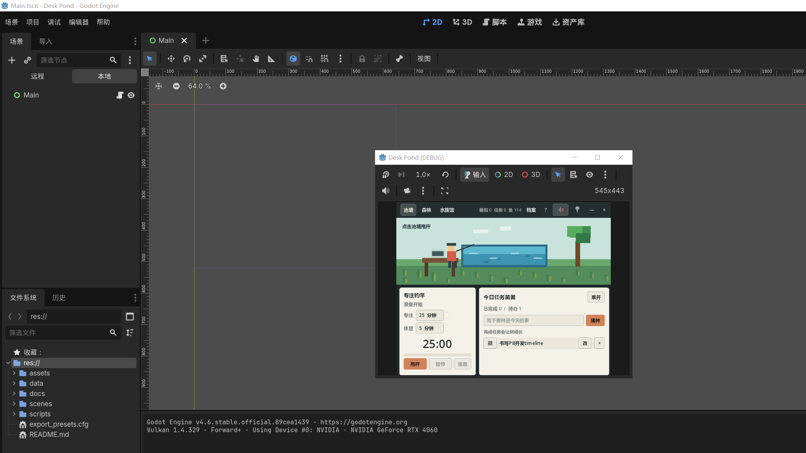

安装就一句话：官网下载、装好、能打开就行（详见文末准备清单）。

## 2. 开发实操：从一句话到桌面桌宠

主线五步，每步就是一段对话。

### Step 1 · 一句话立项，先要个能跑的最小版

> 我想做一个 2D 像素桌面陪伴小游戏：一个小池塘，我点「甩杆」开始专注倒计时，专注结束自动钓上一条鱼；右边能写今日任务，勾完任务小树长一点。用 Godot 帮我搭一个最小可玩版本。

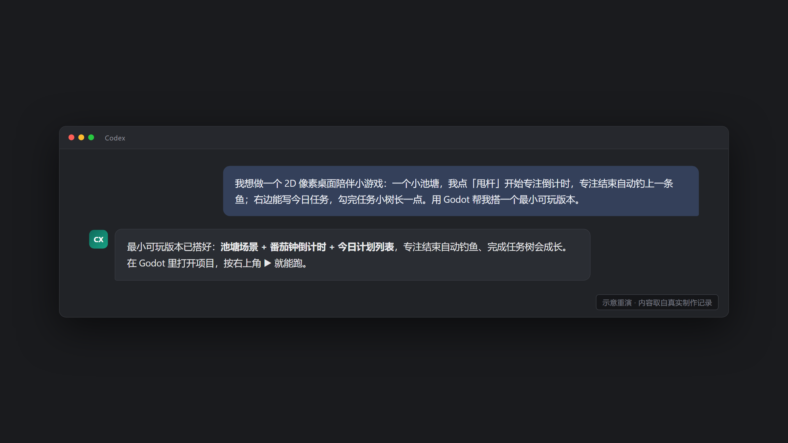

第一版长这样——灰底方块、文字凑合，但番茄钟能走、任务能记：

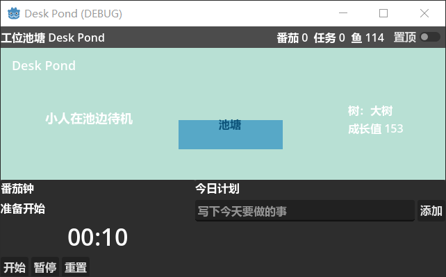

一句话贴士：**第一版丑、功能少都没关系，「能跑起来」就是最大的胜利**，后面全靠迭代。

### Step 2 · 一次加一个功能，玩着迭代

三组真实迭代，每组就一句话：

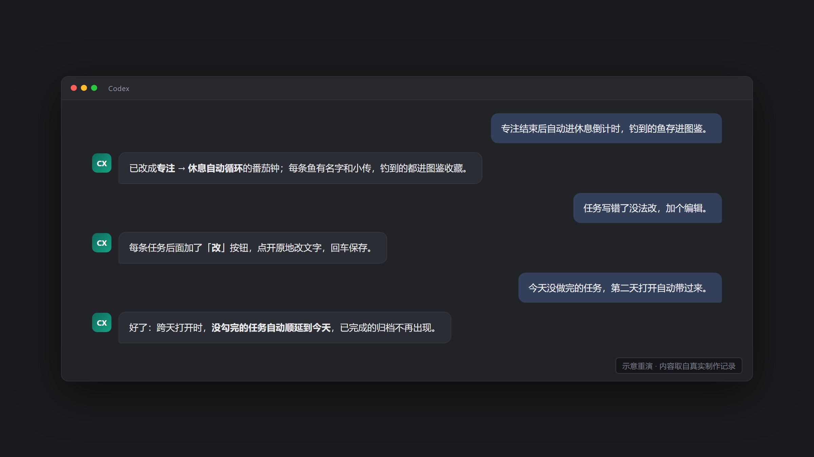

「专注结束自动进休息」变成了会自己循环的番茄钟；「钓到的鱼存进图鉴」变成了每条鱼有名字有小传的收藏册：

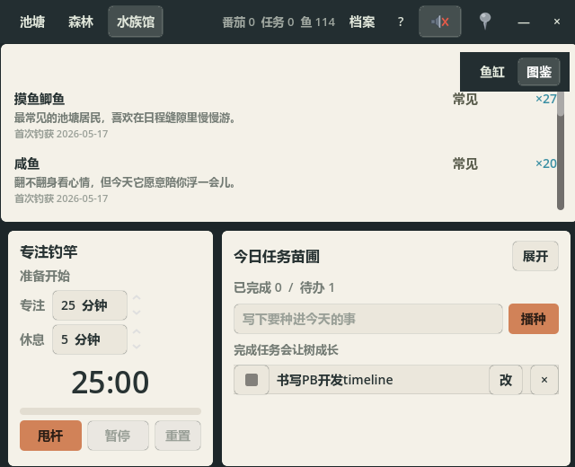

迭代纪律一句话：**一次只提一个功能，自己玩一遍确认了再提下一个。**

选配一句话：玩法想做大（比如这个项目后来的水族馆、森林房间），让 Codex 先写一页设计文档，你点头再动工。

### Step 3 · 让它像个桌宠：去边框、可置顶

> 去掉系统窗口边框，整体统一成极简像素风；顶栏加一个图钉按钮，按下就置顶，让它能一直贴在桌面上。

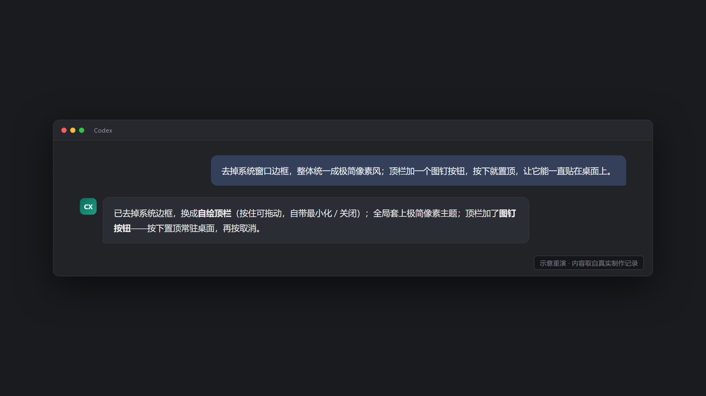

这一步是「一个程序」变成「一只桌宠」的分水岭——没有系统边框、随手一拖、常驻眼角：

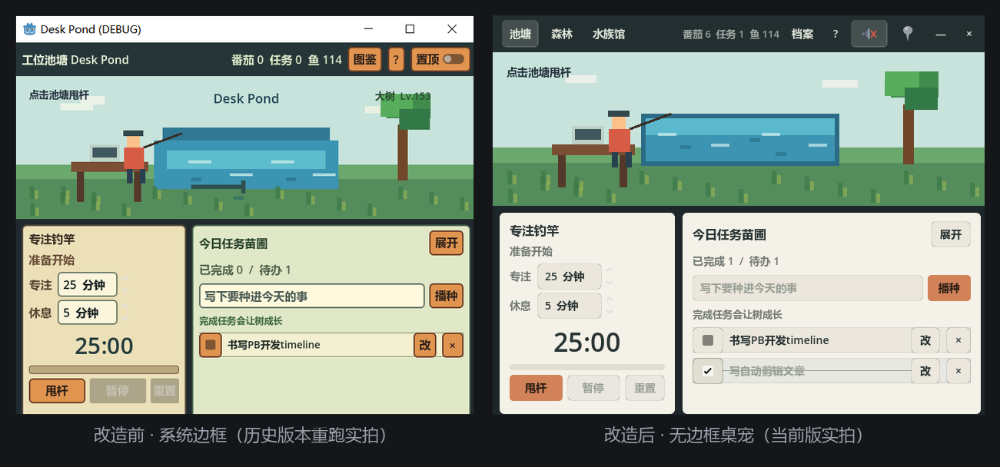

### Step 4 · 发布前，让 Codex 全 app 自检一遍

> 发布前把整个 app 自己从头过一遍，把发现的问题列出来并修掉，修完给我清单。

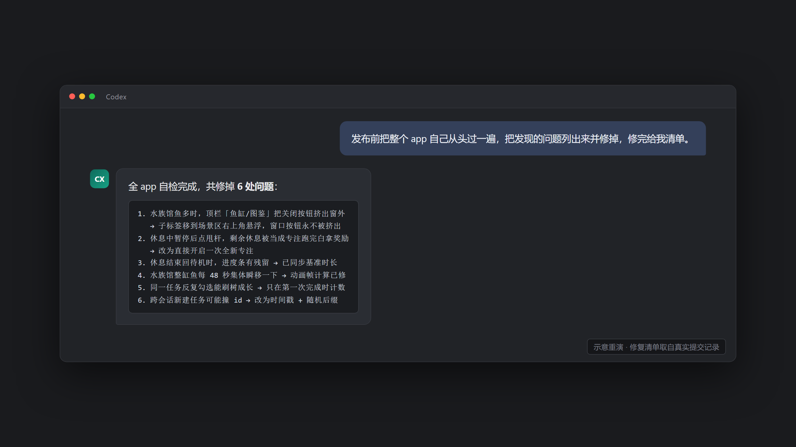

这个项目的一次真实自检，一口气修掉 6 处问题——比如水族馆鱼钓多了以后，顶栏被撑爆，右上角关闭按钮被挤出窗外：

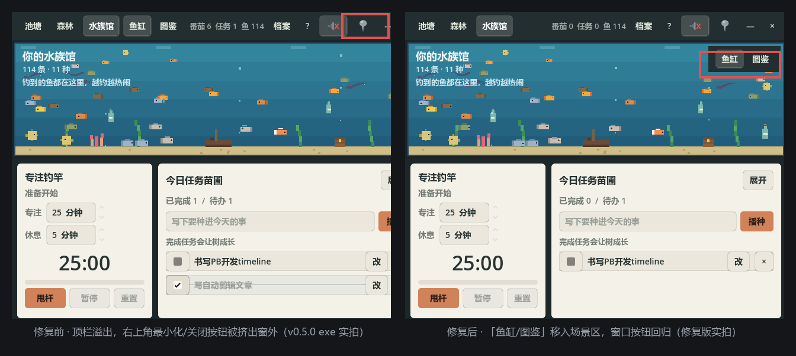

一句话贴士：Codex 能自检出逻辑 bug，但**验不了好不好看、好不好听**——发布前你必须亲手完整玩一遍再放行。

### Step 5 · 打包成双击即用的 exe

> 打包成单个 exe 文件，文件名带上版本号，发我路径。

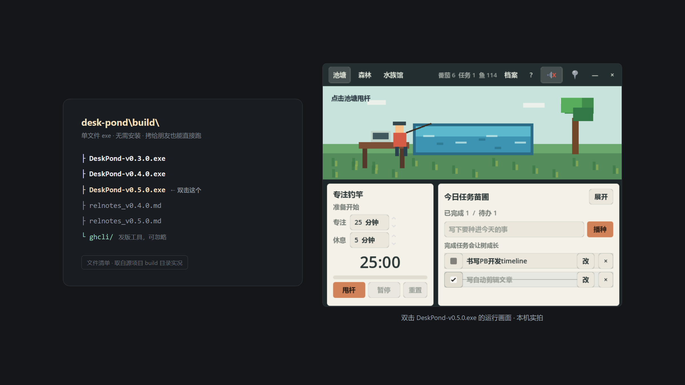

单文件、无需安装，拷给朋友也能直接跑。挂上桌面——从今天起，你的番茄钟有鱼可钓了。

## 3. 打磨与出门（选配）

### 3.1 补齐「作品感」三件套（推荐做）

一段对话搞定三样：环境水声 + 事件音效（顶栏一键静音）、应用图标、首次打开自动弹一次玩法说明。

避坑一句话（这个项目真踩过）：图标这类**审美产物，让 Codex 先出一张真实尺寸预览图，你点头再定稿。** 源项目第一版图标没预览直接用，被「有点丑」打回，重做成彩色 emoji 风才过关：

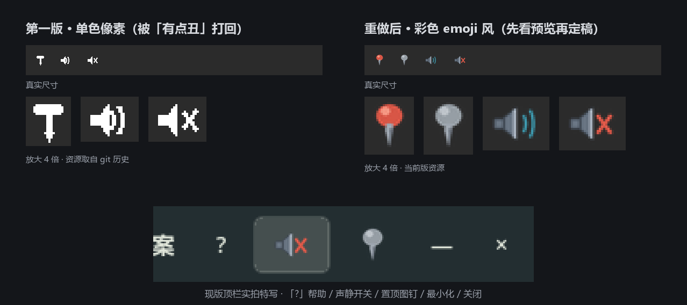

### 3.2 分享给别人（进阶选配）

一句话：让 Codex 把 exe 发到 GitHub Releases 生成下载链接；还能导出网页版给手机玩。想深入的自行探索，本章不展开。

收束一句：之后每个新想法都是同一套循环——**对话加功能 → 自己玩一遍 → 自检 → 重新打包。**

## 结尾卡片 · 开工前的准备清单

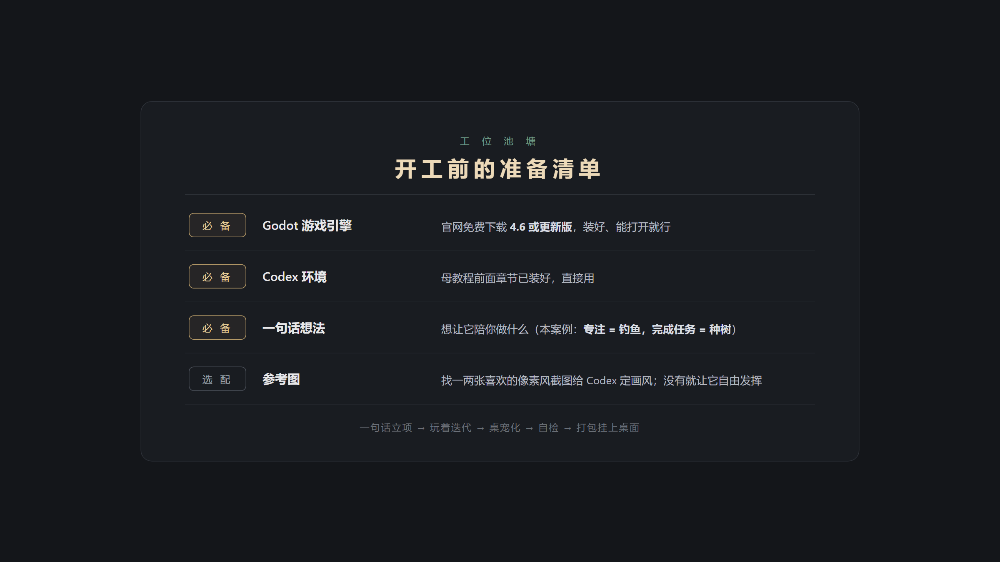

---

## 附：配图素材说明（制作侧，不进学员版）

| 图 | 类型 | 来源 |
|---|---|---|
| 图1 | 实拍 | v0.5.0 exe 置顶挂桌面角落，本机截屏裁切 |
| 图2 | 实拍拼接 | 森林=v0.5.0 exe 实拍；水族馆=修复版（`759f3d4`）Godot 运行实拍 |
| 图3 | 设计卡片 | 班底卡片（HTML 渲染） |
| 图4 | 实拍 | Godot 4.6 打开源项目、F5 运行的整屏实拍 |
| 图5/7/9/11 | 示意重演 | 对话内容取自真实提交记录，图内已标注 |
| 图6 | 历史版实拍 | MVP 提交 `7b2945b` 检出重跑（带系统边框，含 DEBUG 字样） |
| 图8 | 实拍 | 修复版图鉴页，鱼名/小传/钓获日期为真实存档数据 |
| 图10 | 实拍对比 | 左=去边框前版本（`1593c5a` 检出重跑），右=当前版 exe |
| 图12 | 实拍对比+标注 | 左=v0.5.0 exe 复现的真实 bug（该 exe 构建早于自检修复提交），右=修复版；红框为后加标注 |
| 图13 | 混合 | 左=真实 build 目录清单渲染，右=exe 运行实拍 |
| 图14 | 历史资源+实拍 | 旧图标取自 git 历史（`5596afc^`），新图标为当前版资源，底部为现版顶栏实拍特写 |
| 图15 | 设计卡片 | 准备清单卡片（HTML 渲染） |

录屏：`素材/工位池塘_桌面运行.mp4`，19 秒 640x520，v0.5.0 exe 甩杆→专注计时实录（窗口画面逐帧采集合成，无声）。
